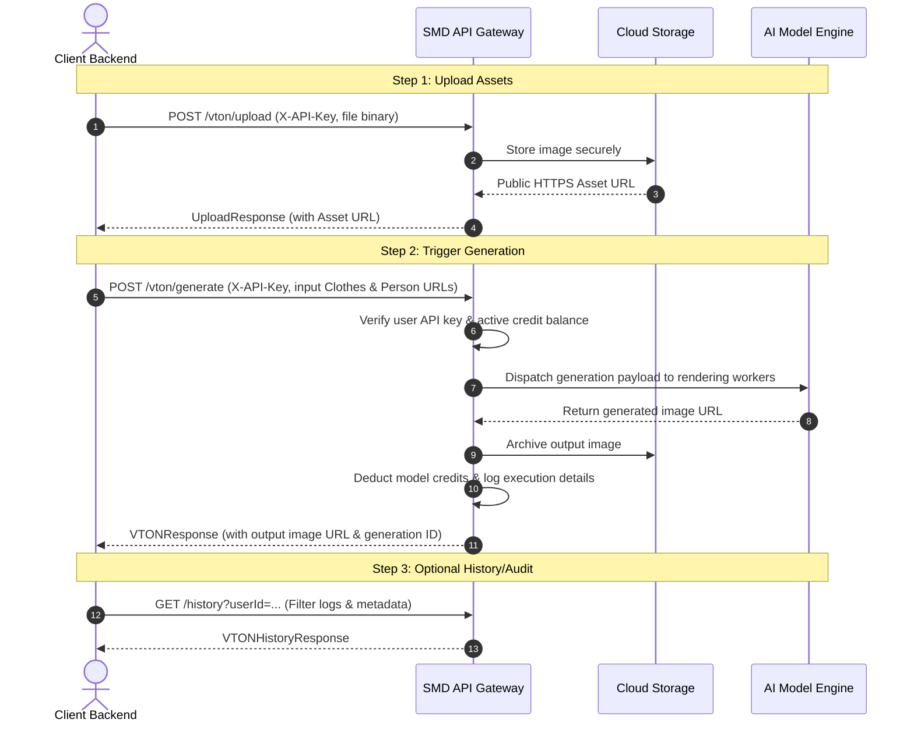

# Snapmydesign (SMD) VTON API Documentation

Welcome to the **Snapmydesign (SMD) Virtual Try-On (VTON) API Reference**. This documentation is designed to guide external developers and enterprise partners through integrating our VTON services into their own applications, e-commerce storefronts, and pipelines.

Our VTON API allows you to upload photos of models/customers and garments, and generate highly realistic try-on results powered by cutting-edge AI models running on premium platforms.

---

## 📌 Quick Reference

| Detail | Value |
| :--- | :--- |
| **API Base URL** | `https://apisdk.snapmydesign.com/api/v1` |
| **Authentication Header** | `X-API-Key: <smd_live_...>` |
| **Support Email** | `contactus@snapmydesign.com` |

---

## Table of Contents
1. [Authentication](#-authentication)
2. [Integration Workflow](#-integration-workflow)
3. [VTON Model & Credit Matrix](#-vton-model--credit-matrix)
4. [Endpoint Reference](#-endpoint-reference)
   - [Upload VTON Images (`POST /vton/upload`)](#1-upload-vton-images-post-vtonupload)
   - [Generate Try-On (`POST /vton/generate`)](#2-generate-try-on-post-vtongenerate)
   - [Check Credits (`POST /user/credits`)](#3-check-credits-post-usercredits)
   - [Get Generation History (`GET /history`)](#4-get-generation-history-gethistory)
   - [Service Health Check (`GET /vton`)](#5-service-health-check-getvton)
5. [Error Handling & Exceptions](#-error-handling--exceptions)
6. [Integration Code Examples](#-integration-code-examples)
   - [cURL](#curl)
   - [Python](#python)
   - [Node.js (Axios)](#nodejs-axios)

---

## 🔐 Authentication

All request categories that process uploads or trigger generations must authenticate using an API key. 

To authorize your request, add the following header:

```http
X-API-Key: smd_live_your_api_key_here
```

> [!IMPORTANT]
> Keep your API key secure. Do not share it publicly or expose it in client-side code (browsers/mobile apps). Always route API calls through your backend service to keep the API key safe.

---

## 🔄 Integration Workflow

The typical API integration follows a three-step cycle:



---

## 📊 VTON Model & Credit Matrix

Billed usage is based on **Credits**. Each virtual try-on execution deducts credits depending on the version and model type (`model_name`) chosen in the request.

| Version | Model Name (`model_name`) | Credit Cost | Description |
| :--- | :--- | :--- | :--- |
| **1.0** (Default) | `fast` | **0.25** | Highly optimized for rapid previewing. |
| **1.0** (Default) | `medium` | **0.50** | Great balance of speed and structural details. |
| **1.0** (Default) | `quality` | **1.00** | Ultra-fine resolution, premium rendering quality. |
| **1.1** | `fast` | **0.25** | Rapid generation run on premium cluster. |
| **1.1** | `medium` | **0.50** | Enhanced fidelity run on premium cluster. |
| **1.1** | `quality` | **1.00** | Exceptional edge preservation and detail accuracy. |

---

## 🛠️ Endpoint Reference

### 1. Upload VTON Images (`POST /vton/upload`)

Upload image files (person profiles, garment photos) to obtain the public cloud URLs required for triggering the try-on generator.

* **Path:** `/vton/upload`
* **Content-Type:** `multipart/form-data`
* **Authentication:** Required (`X-API-Key` header)

#### Request parameters (Form-Data)

| Field | Type | Required | Description |
| :--- | :--- | :--- | :--- |
| `files` | `List[Binary]` | **Yes** | 1 to 4 image files to upload. Supports JPEG, PNG, WEBP. |
| `userId` | `string` | **Yes** | The user ID associated with the API key owner. |
| `resolution` | `integer` | No | Target resolution limit. Default is `1000` (auto-resize/optimize). |

#### Response (`UploadResponse`)

```json
{
  "success": true,
  "statusCode": 200,
  "message": "Upload successful",
  "uploaded": [
    {
      "id": "e4a2d8b5-908c-4a34-be57-410a0e954a1a",
      "url": "https://firebasestorage.googleapis.com/v0/b/xdesign-d72cd.appspot.com/o/vton_uploaded_image..."
    }
  ]
}
```

---

### 2. Generate Try-On (`POST /vton/generate`)

Trigger the virtual try-on rendering engine. This is an asynchronous model call wrapped in a synchronous API endpoint that returns the finished URL when done.

* **Path:** `/vton/generate`
* **Content-Type:** `application/json`
* **Authentication:** Required (`X-API-Key` header)

#### Request Body (`VTONRequest`)

| Field | Type | Required | Default | Description |
| :--- | :--- | :--- | :--- | :--- |
| `model_name` | `string` | **Yes** | — | Choose: `"fast"`, `"medium"`, or `"quality"`. |
| `inputClothesImageUrls` | `List[string]` | **Yes** | — | List of 1 to 4 garment image URLs (obtained from `/vton/upload` or public URLs). |
| `inputPersonImageUrls` | `List[string]` | No | `[]` | List of up to 4 reference model URLs. |
| `prompt` | `string` | No | `""` | Optional instruction prompt. If blank, is auto-generated. |
| `version` | `float` | No | `1.0` | Model version map: `1.0` or `1.1`. |
| `productId` | `string` | No | `null` | Optional internal catalog SKU/ID (helps track product usage metrics). |
| `externalUserId` | `string` | No | `null` | Optional end-consumer identifier of your client application. |
| `metadata` | `object` | No | `null` | Optional key-value dictionary for storing custom properties. |

> [!TIP]
> **Prompt Auto-Generation:** If you leave `prompt` empty, the backend engine dynamically builds a highly descriptive VTON prompt based on the layout and number of input images (e.g. *"Replace the clothing in the first image with the garment from the 2nd image."*).

#### Response (`VTONResponse`)

```json
{
  "success": true,
  "statusCode": 200,
  "message": "success",
  "generationId": "50c76d05-4f40-424a-9ef8-11db9390234a",
  "outputImageUrls": [
    "https://firebasestorage.googleapis.com/.../vton_generated_image..."
  ],
  "inputClothesImageUrls": [
    "https://firebasestorage.googleapis.com/.../vton_uploaded_image..."
  ],
  "inputPersonImageUrls": [],
  "userId": "user_abc123",
  "creditCost": 0.5,
  "modelName": "medium",
  "version": 1.0,
  "prompt": "Replace the clothing in the first image with the garment from the 1th image.",
  "productId": "sku_9921_blue",
  "externalUserId": "consumer_myntra_77612",
  "metadata": {
    "campaign": "summer_sale_2026",
    "gender": "male"
  },
  "startTimestamp": 1780000000,
  "endTimestamp": 1780000005,
  "apiKeyLabel": "production_server_key"
}
```

---

### 3. Check Credits (`POST /user/credits`)

Query the current credit balance of your developer account.

* **Path:** `/user/credits`
* **Content-Type:** `application/json`
* **Authentication:** Optional (authenticated via API Key or direct request payload)

#### Request Body (`UserCreditsRequest`)

| Field | Type | Required | Description |
| :--- | :--- | :--- | :--- |
| `userId` | `string` | **Yes** | The user ID to query. |

#### Response (`UserCreditsResponse`)

```json
{
  "success": true,
  "statusCode": 200,
  "message": "User credits found",
  "credits": {
    "user": {
      "userId": "user_abc123"
    },
    "credits": 42.5
  }
}
```

---

### 4. Get Generation History (`GET /history`)

Retrieve a paginated list of previous try-on generations for auditing and usage analytics.

* **Path:** `/history`
* **Authentication:** Optional

#### Query Parameters

| Parameter | Type | Required | Default | Description |
| :--- | :--- | :--- | :--- | :--- |
| `userId` | `string` | **Yes** | — | User ID of the developer account. |
| `limit` | `integer` | No | `20` | Limit results (range `1` to `100`). |
| `startTimestamp` | `integer` | No | — | Filter generations started on/after this UNIX timestamp. |
| `endTimestamp` | `integer` | No | — | Filter generations ended on/before this UNIX timestamp. |
| `apiKeyLabel` | `string` | No | — | Filter by the specific API key label used. |
| `productId` | `string` | No | — | Filter by catalog product SKU. |
| `externalUserId` | `string` | No | — | Filter by client consumer ID. |

#### Response (`VTONHistoryResponse`)

```json
{
  "success": true,
  "statusCode": 200,
  "message": "success",
  "data": [
    {
      "generationId": "50c76d05-4f40-424a-9ef8-11db9390234a",
      "userId": "user_abc123",
      "creditCost": 0.5,
      "numberOfImages": 1,
      "outputImageUrls": [
        "https://firebasestorage.googleapis.com/.../vton_generated_image..."
      ],
      "inputClothesImageUrls": [
        "https://firebasestorage.googleapis.com/.../vton_uploaded_image..."
      ],
      "inputPersonImageUrls": [],
      "prompt": "Replace the clothing in the first image with the garment from the 1th image.",
      "version": 1.0,
      "modelName": "medium",
      "apiKeyLabel": "production_server_key",
      "startTimestamp": 1780000000,
      "endTimestamp": 1780000005,
      "productId": "sku_9921_blue",
      "externalUserId": "consumer_myntra_77612",
      "metadata": {
        "campaign": "summer_sale_2026"
      }
    }
  ],
  "nextCursor": "gen_87a9bf...",
  "limit": 20,
  "totalCount": 1
}
```

---

### 5. Service Health Check (`GET /vton`)

Fast endpoint to perform load-balancer verification or check if our service router is running correctly.

* **Path:** `/vton`
* **Authentication:** No

#### Response

```json
{
  "success": true,
  "statusCode": 200,
  "message": "success",
  "mode": "vton service from SMD SDK",
  "data": []
}
```

---

## ⚠️ Error Handling & Exceptions

Our API returns structured errors whenever validation fails, credits are depleted, or credentials are invalid.

### Standard Error Body

```json
{
  "success": false,
  "statusCode": 401,
  "message": "Invalid or revoked API Key.",
  "detail": "Invalid or revoked API Key."
}
```

### Response Status Codes

| HTTP Status | Exception Class | Description | Recommended Resolution |
| :--- | :--- | :--- | :--- |
| **`400`** | `HTTPException` | Request parameters are missing or formatted incorrectly. | Verify fields and types against schemas. |
| **`401`** | `InvalidAPIKeyError` | Missing, invalid, or revoked `X-API-Key` header. | Verify key syntax (`smd_live_...`) and status in dashboard. |
| **`403`** | `UnauthorizedError` | Requested `userId` does not match the authenticated API key owner. | Ensure correct matching `userId` payload. |
| **`404`** | `UserNotFoundError` / `APIKeyNotFoundError` | Database lookup failed for the provided user ID or API key. | Verify the target user exists. |
| **`422`** | `RequestValidationError` | JSON payload schema validation failed (FastAPI standard). | Inspect the `detail` object to pinpoint validation issues. |
| **`501`** | `InsufficientCreditsError`| Credit balance is lower than the model credit cost. | Direct the developer to buy credit top-up packages. |
| **`500`** | `InternalServerError` | An unhandled error occurred within the engine. | Retry the request after a backoff period. |

---

## 💻 Integration Code Examples

Below are fully functioning examples to help you integrate SMD VTON into your software environment.

### cURL

```bash
# Step 1: Upload a file to receive a public URL
curl -X POST "https://apisdk.snapmydesign.com/api/v1/vton/upload" \
  -H "X-API-Key: smd_live_your_key_here" \
  -F "files=@/path/to/tshirt.png" \
  -F "userId=user_abc123"

# Step 2: Trigger Generation using the uploaded URL
curl -X POST "https://apisdk.snapmydesign.com/api/v1/vton/generate" \
  -H "X-API-Key: smd_live_your_key_here" \
  -H "Content-Type: application/json" \
  -d '{
    "model_name": "medium",
    "inputClothesImageUrls": [
      "https://firebasestorage.googleapis.com/v0/b/xdesign-d72cd.appspot.com/o/vton_uploaded_image%2Ftshirt.png"
    ],
    "inputPersonImageUrls": [],
    "prompt": "Put the shirt on the model",
    "version": 1.0,
    "userId": "user_abc123"
  }'
```

### Python

```python
import requests

API_KEY = "smd_live_your_key_here"
BASE_URL = "https://apisdk.snapmydesign.com/api/v1"
USER_ID = "user_abc123"

headers = {
    "X-API-Key": API_KEY
}

# 1. Upload the image file
upload_url = f"{BASE_URL}/vton/upload"
files = [
    ("files", ("tshirt.png", open("tshirt.png", "rb"), "image/png"))
]
data = {
    "userId": USER_ID,
    "resolution": 1000
}

response = requests.post(upload_url, headers=headers, files=files, data=data)
response.raise_for_status()
uploaded_assets = response.json()["uploaded"]
garment_url = uploaded_assets[0]["url"]
print(f"Uploaded asset public URL: {garment_url}")

# 2. Trigger try-on generation
generate_url = f"{BASE_URL}/vton/generate"
payload = {
    "model_name": "medium",
    "inputClothesImageUrls": [garment_url],
    "inputPersonImageUrls": [],  # Optional reference model images
    "prompt": "Put the uploaded garment on the model",
    "version": 1.0,
    "userId": USER_ID,
    "productId": "SKU-TSHIRT-BLUE-M",
    "metadata": {
        "client": "mobile_app",
        "env": "production"
    }
}

gen_response = requests.post(generate_url, headers=headers, json=payload)
gen_response.raise_for_status()
result = gen_response.json()

if result.get("success"):
    print(f"Successfully generated try-on!")
    print(f"Output Image URL: {result['outputImageUrls'][0]}")
    print(f"Generation ID: {result['generationId']}")
    print(f"Transaction Cost: {result['creditCost']} credits")
else:
    print(f"Generation failed: {result.get('message')}")
```

### Node.js (Axios)

```javascript
const axios = require('axios');
const fs = require('fs');
const FormData = require('form-data');

const API_KEY = 'smd_live_your_key_here';
const BASE_URL = 'https://apisdk.snapmydesign.com/api/v1';
const USER_ID = 'user_abc123';

async function generateTryon() {
  try {
    // 1. Prepare and send Multipart file upload
    const form = new FormData();
    form.append('files', fs.createReadStream('./tshirt.png'));
    form.append('userId', USER_ID);
    form.append('resolution', '1000');

    const uploadResponse = await axios.post(`${BASE_URL}/vton/upload`, form, {
      headers: {
        ...form.getHeaders(),
        'X-API-Key': API_KEY
      }
    });

    const garmentUrl = uploadResponse.data.uploaded[0].url;
    console.log(`Uploaded asset public URL: ${garmentUrl}`);

    // 2. Trigger generation
    const payload = {
      model_name: 'medium',
      inputClothesImageUrls: [garmentUrl],
      inputPersonImageUrls: [],
      prompt: 'Put the shirt on the model',
      version: 1.0,
      userId: USER_ID
    };

    const genResponse = await axios.post(`${BASE_URL}/vton/generate`, payload, {
      headers: {
        'Content-Type': 'application/json',
        'X-API-Key': API_KEY
      }
    });

    if (genResponse.data.success) {
      console.log('Successfully generated try-on!');
      console.log(`Output Image URL: ${genResponse.data.outputImageUrls[0]}`);
      console.log(`Generation ID: ${genResponse.data.generationId}`);
      console.log(`Transaction Cost: ${genResponse.data.creditCost} credits`);
    } else {
      console.log(`Generation failed: ${genResponse.data.message}`);
    }
  } catch (error) {
    if (error.response) {
      console.error(`API Error (${error.response.status}):`, error.response.data);
    } else {
      console.error('Request Error:', error.message);
    }
  }
}

generateTryon();
```
